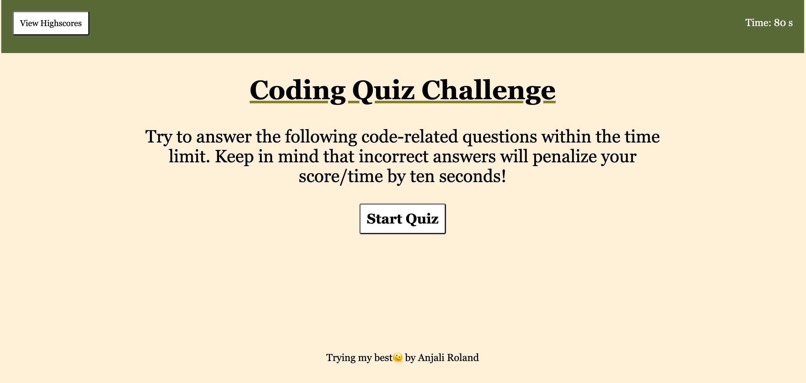

# M4-Web-APIs-Coding-Quiz
<!--
## Description

 This week we were tasked with creating a timed quiz about coding, that can also store highscores. Using what we have learned the past few weeks I was able to use HTMl, CSS, and JavaScript to create a dynamically updating app that meets the following criteria:
 <ul>
 <li>When clicking the start button, the timer starts and I am presented with the first question.
 <li>After answering a question a new question is presented.
 <li>When I answer the question incorrectly time is subtracted from the clock.
 <li>After all the questions are answered or the timer reaches 0 the quiz is over.
 <li>When the game is over I'm able to save my initials and score.

 ## Usage
 
 By clicking the second link below you will be brought to an application that looks like the following screenshot. Once in the application you are able to hit the start quiz button and will be presented with the first question along with 4 potential answers; simultaneously a timer will appear in the corner and time will be counting down for the remainder of the quiz. Once all questions have been answered, you will be shown your score and the ability to type in your initials to save it.

 

 ## Links

Repository: [
    ( )]

Deployed Application: [
    ( )]